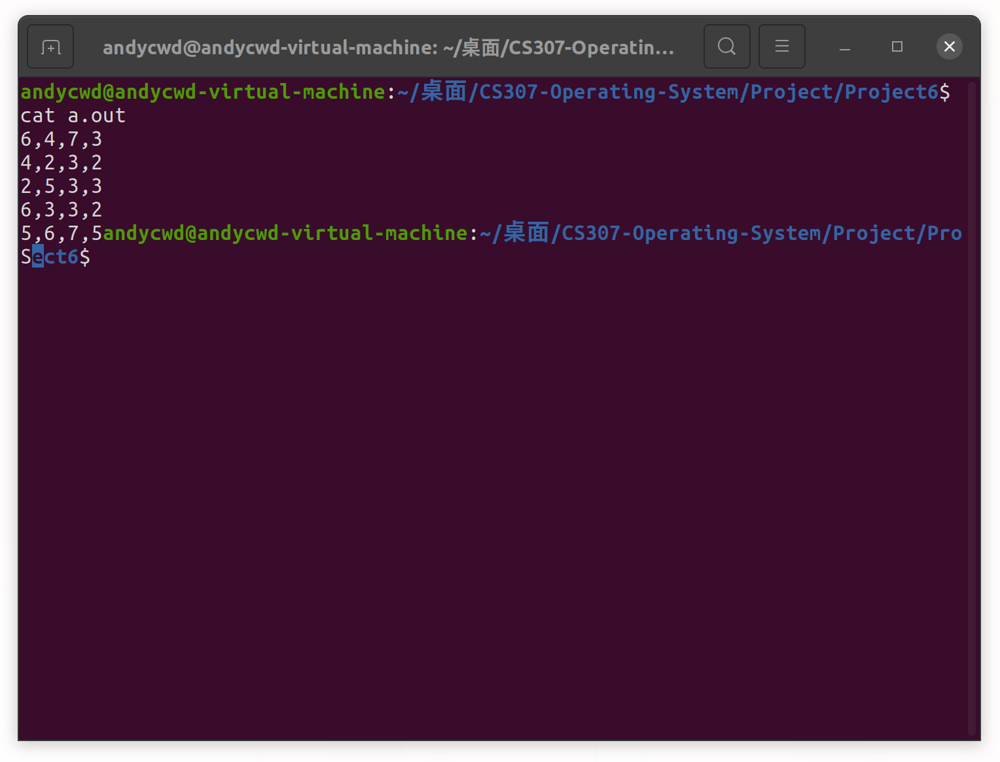
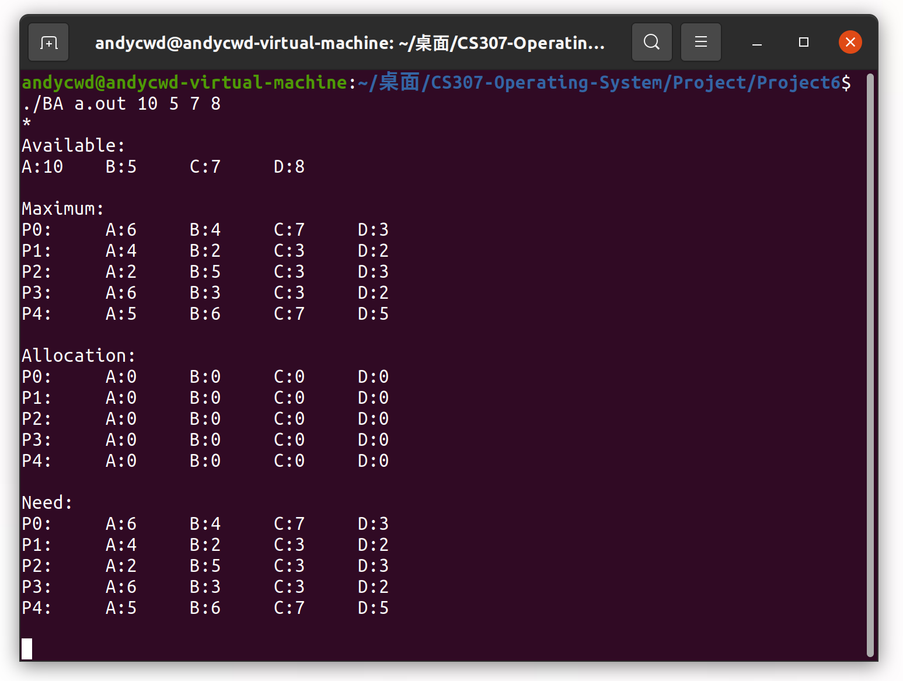
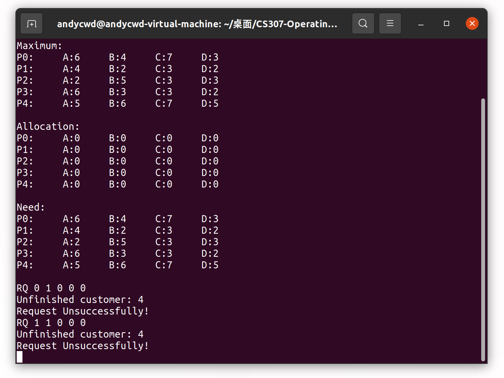
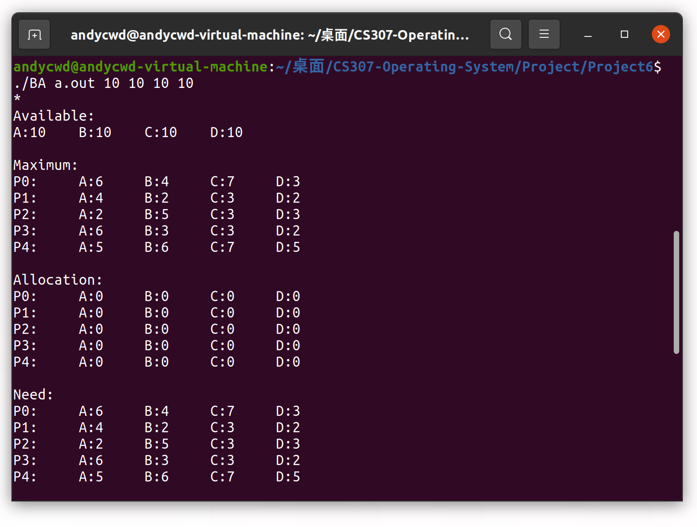
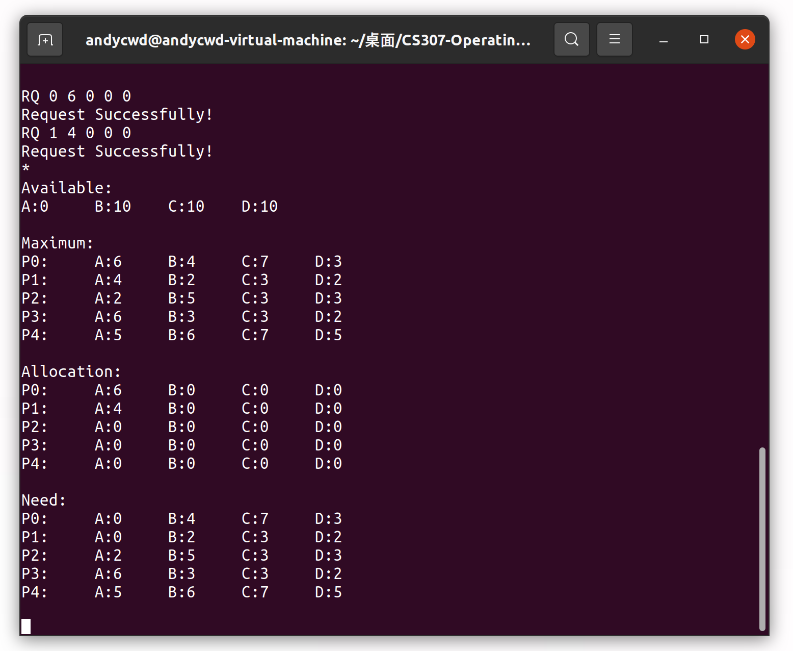
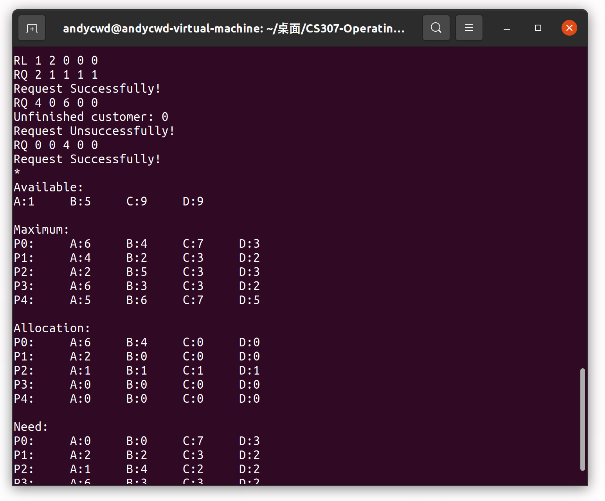
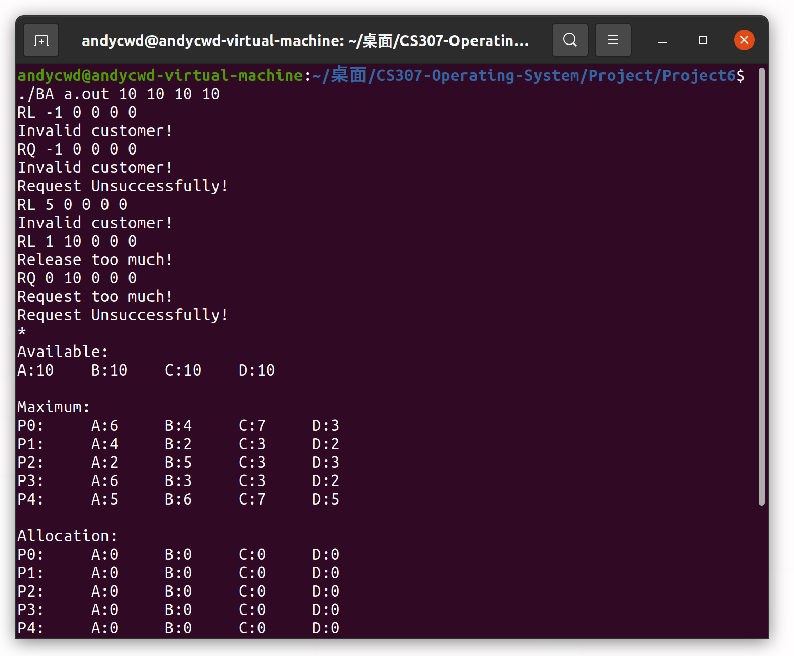

## Report for OS Project 6

### Banker's Algorithm

陈文迪 519021910071

#### I. 实验任务

1. 了解银行家算法的基本思想和判断逻辑。
2. 设计一个基于银行家算法的资源分配器。用户可以向该资源分配器发送请求，若分配资源后系统仍然处于安全状态，则准许该次分配；若分配资源后系统处于非安全状态，则本次请求将被拒绝。该资源分配器是一个交互式的命令行程序，需要提供以下的用户接口：
   - 用户可以通过``RQ``指令来为某一消费者申请资源，如：``RQ 0 3 1 2 1``
   - 用户可以通过``RL``指令来释放某一消费者已获取的资源，如：``RL 4 1 2 3 1``
   - 用户可以通过``*``指令来查看全部的数据结构包括``available``，``maximum``，``allocation``，和``need`` 数组
   - 用户可以通过``exit``指令退出交互式程序

#### II. 实验思路

##### 1. 银行家算法概览

银行家算法本质上是一个**贪心模型**，它可以用于处理多实例资源分配问题。

对于每一个消费者，我们维护如下的数据结构：``Allocation``表示已分配给该消费者的各类资源的实例数量，``Maximum``表示该消费者对各类资源最多需要多少实例，``Need``表示该消费者对于各类资源分别还需要多少实例。我们保证对于线程$T_i$，我们始终有$Need_i=Maximum_i-Allocation_i$。我们还维护一个全局变量``Available``来表示目前系统还有多少可用资源实例。

我们设计的资源请求算法如下：

1. 如果$Request_i\le Need_i$，则跳转至第二步。否则我们向用户提示一个错误，因此此时请求的资源数量已经超出了最大请求数。

2. 如果$Request_i\le Available$，则跳转至第三步。否则我们也向用户提示一个错误，因为此时就算把全部资源都分配给$T_i$，我们也不能满足要求。

3. 我们尝试给$T_i$分配资源，并更新数据结构。
   $$
   Available = Available - Request_i
   $$

   $$
   Allocation_i = Allocation_i + Request_i
   $$

   $$
   Need_i = Need_i - Request_i
   $$

   接着我们判断该状态是否**安全**，如果安全则分配成果，否则我们需要把各类数据结构恢复到分配之前的状态。

判断系统状态是否安全的算法如下：

1. 创建两个数组``Work``和``Finish``，大小分别是资源类型的数目和消费者数。并执行如下初始化$Work = Available$，$Finish[i]=false, i=0,1,\cdots,n-1$。

2. 寻找一个下标$i$使得：

   - $Finish[i]==false$
   - $Need_i\le Work$

   若不存在这样的$i$，则跳转至步骤4。

3. $Work = Work + Allocation_i$

   $Finish[i]=true$

   跳转至步骤2。

4. 如果对于所有$i$，$Finish[i]==true$都成立，则这个系统处于安全状态。

##### 2. Banker's Algorithm的实现

在了解了银行家算法的基本原理后，它的实现是简单的。

我们先依照算法的要求，建立如下的数据结构。需要注意的是，这些数据结构并不是相互独立的，因此我们需要设计一个函数``update``，当修改其中一个数据结构时，其余数据结构可以相应更新。我们保证在操作中不会直接修改``need``中的值。同样，我们需要依据用户的输入完成这些数据结构的初始化，这些工作由``init``函数完成。

```c
int available[NUMBER_OF_RESOURCES];
int maximum[NUMBER_OF_CUSTOMERS][NUMBER_OF_RESOURCES];
int allocation[NUMBER_OF_CUSTOMERS][NUMBER_OF_RESOURCES];
int need[NUMBER_OF_CUSTOMERS][NUMBER_OF_RESOURCES];

void update(){
    for(int i = 0;i<NUMBER_OF_CUSTOMERS;++i){
        for(int j = 0;j<NUMBER_OF_RESOURCES;++j){
            need[i][j] = maximum[i][j] - allocation[i][j];
        }
    }
}

void init(char *argv[]){
    FILE * in = fopen(argv[1],"r");

    char task[SIZE];
    int request;
    char *temp;
    
    for(int i = 0;i<NUMBER_OF_CUSTOMERS;++i) {
        fgets(task,SIZE,in);
        temp = strdup(task);
        
        for(int j = 0;j<NUMBER_OF_RESOURCES;++j){
            maximum[i][j] = atoi(strsep(&temp,","));
        }
        free(temp);
    }

    for(int i = 0;i<NUMBER_OF_RESOURCES;++i){
        available[i] = atoi(argv[i+2]);
    }

    fclose(in);

    update();
}
```

释放资源函数``release_resources``是简单的，因为我们只需要按照用户请求减少对于的``Allocation``中的值并增加``Available``的值，最后更新数据结构即可。需要注意的是，我们需要添加一些**异常处理**。

```c
void release_resources(int customer_num,int release[]){
    if(customer_num<0||customer_num>=NUMBER_OF_CUSTOMERS){
        printf("Invalid customer!\n");
            return;
    }
    for(int i =0;i<NUMBER_OF_RESOURCES;++i){
        if(allocation[customer_num][i]<release[i]){
            printf("Release too much!\n");
            return;
        }   
    }
    for(int i =0;i<NUMBER_OF_RESOURCES;++i){
        allocation[customer_num][i]-=release[i];
        available[i]+=release[i];
    }
    update();
}
```

对于请求资源函数``request_resources``的实现，我们只需要按照银行家算法的流程依次实现即可。当分配成功时，我们返回0，否则返回-1。需要注意的是，当分配失败时，我们需要恢复数据结构的值，这可以通过调用``release_resources``实现。

```c
int request_resources(int customer_num,int request[]){
    if(customer_num<0||customer_num>=NUMBER_OF_CUSTOMERS){
        printf("Invalid customer!\n");
        return -1;
    }
    for(int i = 0;i<NUMBER_OF_RESOURCES;++i){
        if(need[customer_num][i]<request[i] || available[i]<request[i] ){
            printf("Request too much!\n");
            return -1;
    	}
    }
    for(int i = 0;i<NUMBER_OF_RESOURCES;++i){
        available[i]-=request[i];
        allocation[customer_num][i]+=request[i];
    }
    update();

    int finish[NUMBER_OF_CUSTOMERS];
    for(int i =0;i<NUMBER_OF_CUSTOMERS;++i){
        finish[i] = 0;
    }
    int work[NUMBER_OF_RESOURCES];
    for(int i =0;i<NUMBER_OF_RESOURCES;++i){
        work[i] = available[i];
    }
    int flag = 1;
    while(flag){
        flag = 0;
        for(int i = 0;i<NUMBER_OF_CUSTOMERS;++i){
            if(finish[i]) continue;
            int inner_flag = 1;
            for(int j = 0;j<NUMBER_OF_RESOURCES;++j){
                if(need[i][j]>work[j]) inner_flag=0;
            }
            if(inner_flag){
                flag = 1;
                finish[i] = 1;
                for(int j = 0;j<NUMBER_OF_RESOURCES;++j){
                    work[j]+=allocation[i][j];
                }
            }
        }
    }
    for(int i = 0;i<NUMBER_OF_CUSTOMERS;++i){
        if(finish[i]==0){
            printf("%d\n",i);
            release_resources(customer_num,request);
            return -1;
        }
    }
    return 0;
}
```

打印函数``print_ds``的实现如下：

```c
void print_ds(){
    printf("Available:\n");
    for(int i = 0;i<NUMBER_OF_RESOURCES;++i){
        printf("%c:%d\t",i+'A',available[i]);
    }
    printf("\n\n");

    printf("Maximum:\n");
    for(int i = 0;i<NUMBER_OF_CUSTOMERS;++i){
        printf("P%d:\t",i);
        for(int j = 0;j<NUMBER_OF_RESOURCES;++j){
            printf("%c:%d\t",j+'A',maximum[i][j]);
        }
        printf("\n");
    }
    printf("\n");

    printf("Allocation:\n");
    for(int i = 0;i<NUMBER_OF_CUSTOMERS;++i){
        printf("P%d:\t",i);
        for(int j = 0;j<NUMBER_OF_RESOURCES;++j){
            printf("%c:%d\t",j+'A',allocation[i][j]);
        }
        printf("\n");
    }
    printf("\n");

    printf("Need:\n");
    for(int i = 0;i<NUMBER_OF_CUSTOMERS;++i){
        printf("P%d:\t",i);
        for(int j = 0;j<NUMBER_OF_RESOURCES;++j){
            printf("%c:%d\t",j+'A',need[i][j]);
        }
        printf("\n");
    }
    printf("\n");
}
```

最后，我们以命令行交互程序的形式实现主函数：

```c
int main(int argc,char *argv []){
    init(argv);
    char task[SIZE];
    char *temp;
    char * command;
    int num;
    int buffer[NUMBER_OF_RESOURCES];
    while(1){
        fgets(task,SIZE,stdin);
        temp = strdup(task);
        command = strsep(&temp," ");
        if(strcmp(command,"*\n") == 0 || strcmp(command,"*") == 0){
            print_ds();
        }
        else if(strcmp(command,"exit\n") == 0 || strcmp(command,"exit") == 0){
            free(temp);
            return 0;
        }
        else if(strcmp(command,"RL") == 0){
            num = atoi(strsep(&temp," "));
            for(int i =0;i<NUMBER_OF_RESOURCES;++i){
                buffer[i] = atoi(strsep(&temp," "));
            }
            release_resources(num,buffer);
        }
        else if(strcmp(command,"RQ") == 0){
            num = atoi(strsep(&temp," "));
            for(int i =0;i<NUMBER_OF_RESOURCES;++i){
                buffer[i] = atoi(strsep(&temp," "));
            }
            int x = request_resources(num,buffer);
            if(x==0){
                printf("Request Successfully!\n");
            }
            else{
                printf("Request Unsuccessfully!\n");
            }
        }
        free(temp);
    }
    return 0;
}
```

#### III. 实验过程

我们先按照课本给出的测试文件和测试输入进行测试。``a.out``的内容如下：



首先，输入``*``打印数据结构：



接着，我们通过``RQ``来请求资源。事实上，在该测试数据下，用于4号消费者需要6个B类型资源，而可用的B类型资源最多只有5个，所以任何资源请求都会被拒绝。



我们更换测试数据，继续进行测试。



再请求资源时可以顺利分配。



我们也可以通过``RL``命令来释放资源。继续测试可以发现，当我们给2号消费者分配``(1,1,1,1)``资源后，系统处于安全状态，故分配可以进行；当我们继续给4号消费者分配``(0,6,0,0)``资源后，系统处于非安全状态，0号进程无法执行完，故我们应该拒绝该请求；最后，我们给0号消费者分配``(0,4,0,0)``资源后，系统处于安全状态，故分配可以进行。



运行完毕后通过``exit``退出即可。

最后，我们测试一下异常处理。



可以看到，我们的资源分配器可以合理判断系统的安全状态，并维护当前的资源分配情况。

#### IV. 遇到的问题

##### 1. 银行家算法的理解

银行家算法采用的是贪心的思想。我们在理解过程中可能会疑惑，我们通过顺序查找查到第一个可分配的消费者，这样的思路是否会出错，会不会使原本安全状态的系统被判定为非安全状态。事实上是不会的，因为当该消费者运行完毕后，它会释放它所持有的全部资源，使得``Available``的大小增加。这就保证了我们采用这样的逻辑做出的判断一定是正确的。

##### 2. 命令行交互程序如何处理用户的输入

我们在之前的shell实验中是从单个字符出发来处理用户输入的，但这种处理方式略显繁琐，事实上我们可以通过一些库函数简化处理过程，如：``atoi()``、``strsep()``和``strdup()``。

##### 3. 保证输入处理鲁棒性

在测试``*``输入时曾发现若用户输入``*``后不输入空格则交互程序不会有任何响应，这是由于``strsep()``的设计所导致的，我们可以通过将代码进行如下修改即可修复该错误：

```c
if(strcmp(command,"*\n") == 0 || strcmp(command,"*") == 0){
    print_ds();
}
```

#### V. 参考资料

[1] Operating System Concept 10th Edition

[2] [strsep() -- get next token from string (mkssoftware.com)](https://www.mkssoftware.com/docs/man3/strsep.3.asp)

[3] [strdup - cppreference.com](https://en.cppreference.com/w/c/experimental/dynamic/strdup)

