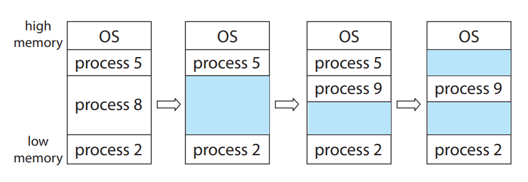
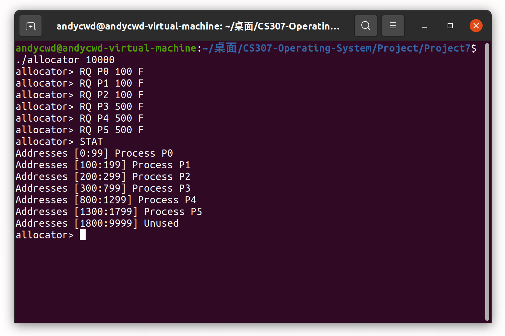
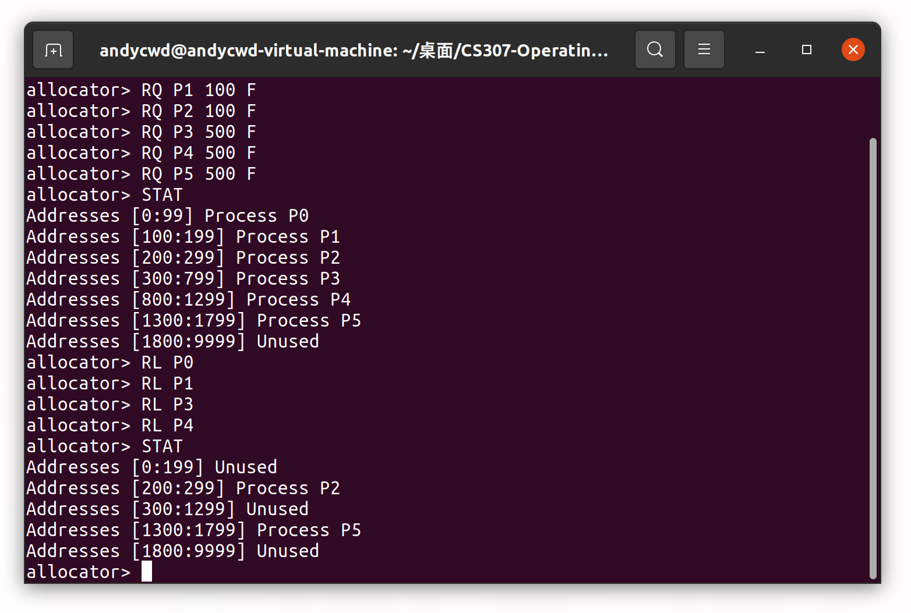
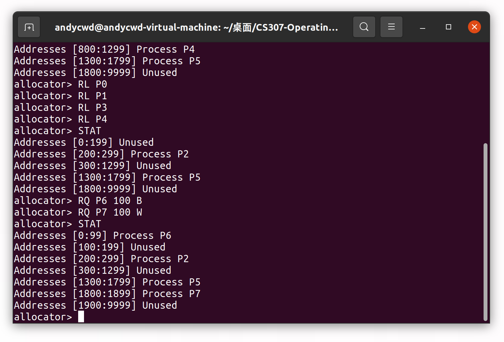
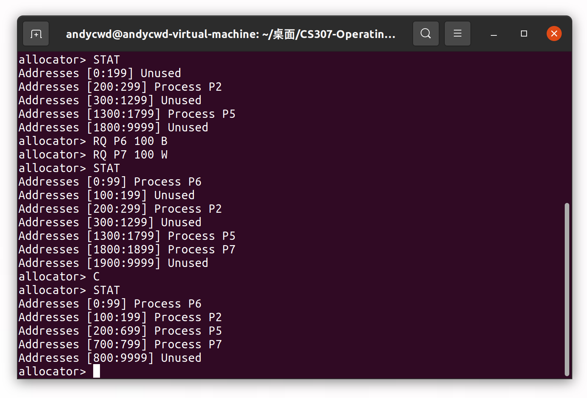
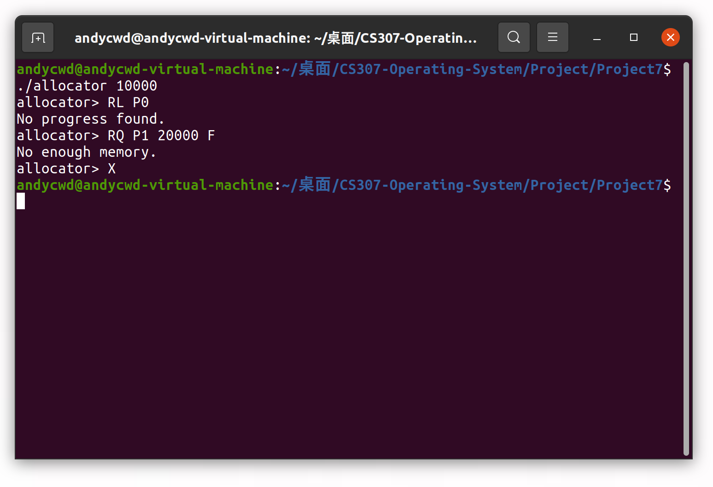

## Report for OS Project 7

### Contiguous Memory Allocation

陈文迪 519021910071

#### I. 实验任务

1. 了解什么是动态存储分配问题（dynamic storage-allocation problem）及其三种分配策略（first-fit，best-fit，worst-fit）。
2. 实现一个连续内存分配器以管理一块连续的地址空间。该内存分配器支持全部的三种分配策略，并具有如下的用户接口：
   - 请求一块连续的内存
   - 释放一块连续的内存
   - 将不使用的内存孔洞合并成单个内存块
   - 展示目前的内存分配情况（包括空闲和已分配的内存块）
   - 输入``X``退出程序

#### II. 实验思路

##### 1. 动态存储分配问题

动态存储分配问题指的是：如何从一个空闲存储孔洞列表中选择一个孔洞分配给目前一个大小为$n$的请求。



对于该问题一般有三种分配策略：

- **First fit** 该策略遍历空闲孔洞列表，遇到第一个满足要求的孔洞时就停止遍历并分配该孔洞。
- **Best fit** 该策略需要遍历整个空闲孔洞列表，分配满足要求的孔洞中最小的孔洞。
- **Worst fit** 该策略需要遍历整个空闲孔洞列表，分配满足要求的孔洞中最大的孔洞。

##### 2. Contiguous Memory Allocation

**基本数据结构**

从设计要求中我们很容易想到应该用一个链表来管理所有空闲或是已分配的内存块。一个链表节点中应该保存以下信息：受否已分配、起始地址、终止地址、进程名称和指向下一个链表节点的指针。为了方便起见，我们采用左闭右开的内存范围，也即该节点表示的内存范围是``[start,end)``。

```c
struct node
{
    int use_flag;
    int start;
    int end;
    char *name;
    struct node *next;
};
```

**实现思路**

首先，整个程序是一个**命令行交互程序**，我们再之前的项目中已经对如何处理用户输入非常熟悉了。因此，在主函数中我们不断读取读取用户输入的指令，将其解析后传给对应的处理接口。**注意：**我们同样需要注意对用户输出处理部分的鲁棒性。

```c
void init(int size);
void request(char *name, int size, char mode);
void release(char *name);
void compact();
void print();
void clear();

int main(int argc, char *argv[])
{
    if (argc != 2)
    {
        printf("Parameter error.\n");
        return -1;
    }
    max_size = atoi(argv[1]);
    init(atoi(argv[1]));
    char task[SIZE];
    char *temp;
    char *command;
    char *name;
    int size;
    char *mode;
    while (1)
    {
        printf("allocator> ");
        fgets(task, SIZE, stdin);
        temp = strdup(task);
        command = strsep(&temp, " ");
        if (strcmp(command, "X\n") == 0 || strcmp(command, "X") == 0)
        {
            free(temp);
            clear();
            return 0;
        }
        else if (strcmp(command, "STAT\n") == 0 || strcmp(command, "STAT") == 0)
        {
            print();
        }
        else if (strcmp(command, "RQ") == 0)
        {
            name = strsep(&temp, " ");
            size = atoi(strsep(&temp, " "));
            mode = strsep(&temp, " ");
            request(name, size, mode[0]);
        }
        else if (strcmp(command, "RL") == 0)
        {
            name = strsep(&temp, " ");
            int i = 0;
            while (name[i] != '\0')
            {
                if (name[i] == '\n')
                {
                    name[i] = '\0';
                    break;
                }
                i++;
            }
            release(name);
        }
        else if (strcmp(command, "C\n") == 0 || strcmp(command, "C") == 0)
        {
            compact();
        }
        else
        {
            printf("Invalid command.\n");
        }
        free(temp);
    }
    return 0;
}
```

接着，我们实现初始化函数``init``和最后程序退出时的清理函数``clear``。初始化函数的功能主要是根据用户的输入初始化内存块链表，其中包含一块连续未分配的内存块节点。清理函数释放所有的内存块节点和节点内动态分配的内存。清理函数非常重要，因为动态内存分配器往往是内核的一部分，内核内存泄漏是非常危险的。

```c
void init(int size)
{
    head = (struct node *)malloc(sizeof(struct node));
    head->use_flag = 0;
    head->start = 0;
    head->end = size;
    head->name = NULL;
    head->next = NULL;
}
void clear()
{
    struct node *p = head, *temp;
    while (p)
    {
        if (p->use_flag)
        {
            free(p->name);
        }
        temp = p;
        p = p->next;
        free(temp);
    }
}
```

展示目前的内存分配情况的函数为``print``，其实现也非常简单。我们只需要遍历链表，依据内存块节点中保存的信息将内存分配信息打印出来即可。需要注意的是，这里我们的内存范围采用闭区间的形式。

```c
void print()
{
    struct node *temp = head;
    while (temp)
    {
        if (temp->use_flag)
        {
            printf("Addresses [%d:%d] Process %s\n", temp->start, temp->end - 1, temp->name);
        }
        else
        {
            printf("Addresses [%d:%d] Unused\n", temp->start, temp->end - 1);
        }
        temp = temp->next;
    }
}
```

然后，我们实现内存释放函数``release``。我们遍历链表，将用户指定的进程内存块标记为未分配。由于我们的数据结构是一个单向链表，所以我们采用双指针的方式进行节点遍历，快指针``fast``是我们准备修改的节点，而慢指针``slow``则指向fast之前的节点。如果``slow``指向的节点也是未分配节点，或者``fast``指向节点的下一个节点是未分配节点，我们需要将这几个节点合并成一个节点。若是没找到相应节点，我们则报告一个错误。**注意：**需要特别讨论头节点等边界情况。

```c
void release(char *name)
{
    struct node *slow = head, *fast = head->next, *temp;
    if (head->name && strcmp(head->name, name) == 0)
    {
        //printf("RL %s",name);
        free(head->name);
        head->name = NULL;
        head->use_flag = 0;
        if (head->next && head->next->use_flag == 0)
        {
            temp = head->next;
            head->end = temp->end;
            head->next = temp->next;
            free(temp);
        }
        return;
    }
    else
    {
        while (fast)
        {
            if (fast->name && strcmp(fast->name, name) == 0)
            {
                free(fast->name);
                fast->name = NULL;
                fast->use_flag = 0;
                if (fast->next && fast->next->use_flag == 0)
                {
                    temp = fast->next;
                    fast->end = temp->end;
                    fast->next = temp->next;
                    free(temp);
                }
                if (slow->use_flag == 0)
                {
                    slow->end = fast->end;
                    slow->next = fast->next;
                    free(fast);
                }
                return;
            }
            fast = fast->next;
            slow = slow->next;
        }
    }
    printf("No progress found.\n");
}
```

孔洞合并函数``compact``的实现同样采用双指针的思想。这次我们统计所有未分配节点所对应的内存大小总和，并将已分配节点不断前移到链表开头，最后再链表结尾添加一个相应的大的未分配节点。

```c
void compact(){
    if(head->end == max_size){
        return;
    }
    struct node * temp, *fast, *slow;
    while(head->use_flag==0){
        temp = head->next;
        free(head);
        head = temp;
    }
    head->end = head->end-head->start;
    head->start = 0;
    slow = head;fast = head->next;
    while(fast){
        if(fast->use_flag==0){
            temp = fast->next;
            free(fast);
            slow->next = temp;
            fast = temp;
        }
        else{
            fast->end = fast->end-fast->start;
            fast->start = slow->end;
            fast->end += slow->end;
            slow = slow->next;fast = fast->next;
        }
    }
    struct node* newnode = (struct node*)malloc(sizeof(struct node));
    newnode->start = slow->end;
    newnode->end = max_size;
    newnode->name = NULL;
    newnode->next = NULL;
    newnode->use_flag = 0;
    slow->next = newnode;
}
```

最后我们实现``request``函数。它根据不同的内存分配策略寻找合适的的节点，若该节点和需求恰好匹配则直接标记即可，否则需要进行节点分裂。若是没有足够大小的节点，则报告一个错误。

```c
void request(char *name, int size, char mode)
{

    struct node *p = head, *temp = NULL;
    int cur_size = -1;
    if (mode == 'F' || mode == 'f')
    {
        while (p)
        {
            if (p->use_flag == 0)
            {
                if (p->end - p->start >= size)
                {
                    temp = p;
                    break;
                }
            }
            p = p->next;
        }
    }

    if (mode == 'B' || mode == 'b')
    {
        while (p)
        {
            if (p->use_flag == 0)
            {
                if (p->end - p->start >= size)
                {
                    if (cur_size < 0 || p->end - p->start < cur_size)
                    {
                        cur_size = p->end - p->start;
                        temp = p;
                    }
                }
            }
            p = p->next;
        }
    }

    if (mode == 'W' || mode == 'w')
    {
        while (p)
        {
            if (p->use_flag == 0)
            {
                if (p->end - p->start >= size)
                {
                    if (cur_size < 0 || p->end - p->start > cur_size)
                    {
                        cur_size = p->end - p->start;
                        temp = p;
                    }
                }
            }
            p = p->next;
        }
    }

    if (temp == NULL)
    {
        printf("No enough memory.\n");
        return;
    }

    if (temp->end - temp->start == size)
    {
        temp->name = (char *)malloc(sizeof(char) * SIZE);
        temp->use_flag = 1;
        strcpy(temp->name, name);
        return;
    }
    else if (temp->end - temp->start > size)
    {
        temp->name = (char *)malloc(sizeof(char) * SIZE);
        temp->use_flag = 1;
        strcpy(temp->name, name);

        struct node *newnode = (struct node *)malloc(sizeof(struct node));
        newnode->end = temp->end;
        temp->end = temp->start + size;
        newnode->start = temp->end;
        newnode->use_flag = 0;
        newnode->name = NULL;
        newnode->next = temp->next;

        temp->next = newnode;
        return;
    }
}
```

#### III. 实验过程

我们运行程序，并指定一块大小为10000的内存区域。接着，我们按照first-fit分配3个大小为100的进程和3个大小为500的进程，并输出目前的内存分配情况。



接着，我们释放P0、P1、P3、P4，可以看到相邻的空闲块得到了合并。



我们按照best-fit分配一个大小为100的进程，再按照worst-fit分配一个大小为100的进程。从结果中可以看到程序按照我们的要求完成了分配。



然后，我们输入``C``来测试孔洞合并。从结果中可以看到程序很好地完成了合并。



最后，我们来测试程序的异常处理功能。从结果中可以看到程序的异常处理功能运行良好。输入``X``退出程序。



#### IV. 遇到的问题

**C语言单链表操作**

对于单链表来说，删除操作一直是一个难点。在本项目中我们巧妙的使用了双指针的结构，该结构通过增加一个指针极大地简化了代码的逻辑，也更容易理解、不易出错。

此外，在本项目中我们经常需要合并节点、移动节点的顺序或是访问与一个节点相邻的节点。对于这些操作，我们需要注意头节点和尾节点的特殊情况来保证程序的鲁棒性。

#### V. 参考资料

[1] Operating System Concept 10th Edition

[2] [链表（单链表）的基本操作及C语言实现](http://data.biancheng.net/view/5.html)

