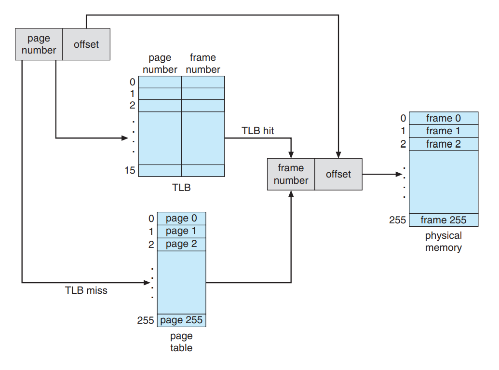
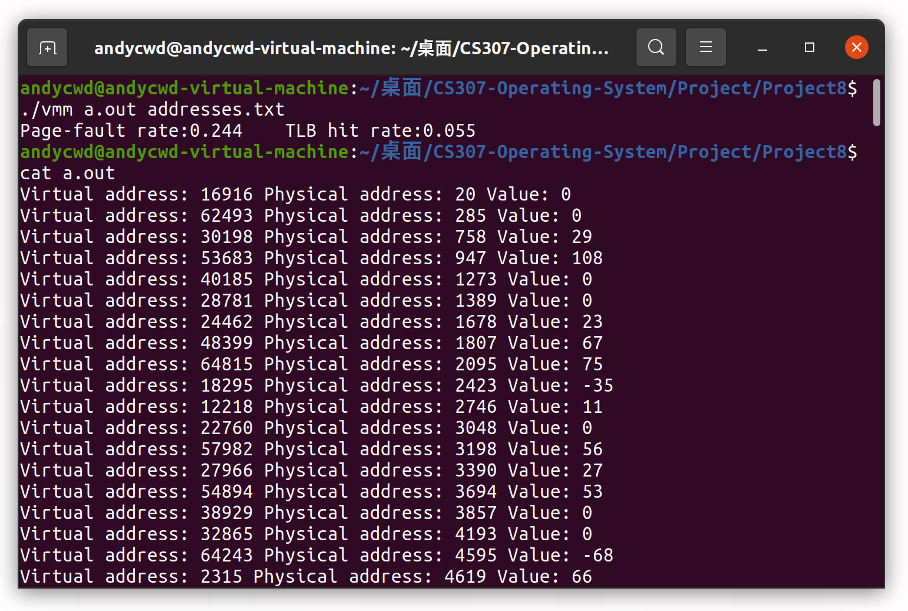
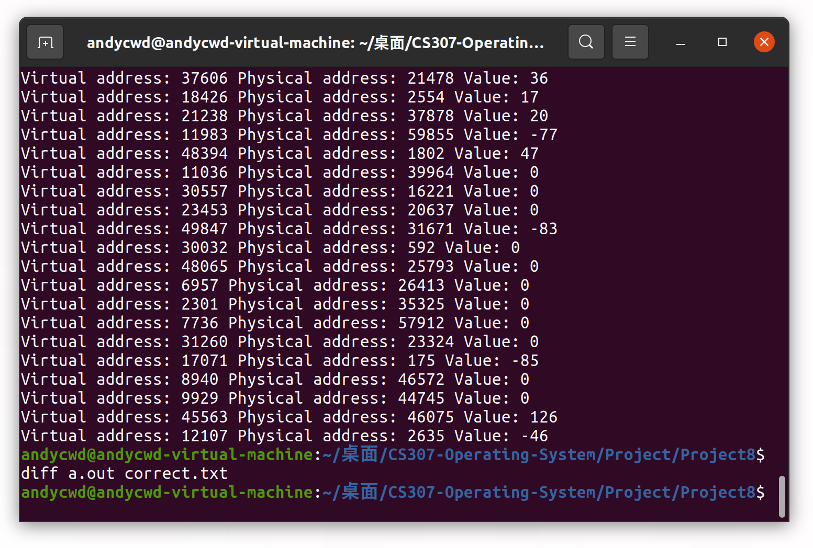
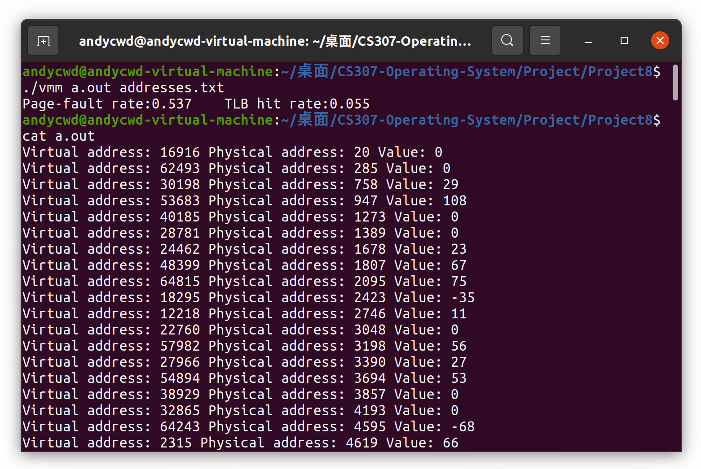

## Report for OS Project 8

### Designing a Virtual Memory Manager

陈文迪 519021910071

#### I. 实验任务

1. 了解从逻辑地址转化到物理地址所涉及到的各个步骤，如：如何通过请求调页解决缺页错误，如何管理TLB和页替换算法。

2. 实现一个虚拟内存管理器，逻辑地址空间的大小为$2^{16}=65536$ bytes。该虚拟内存管理器从一个文件中读取虚拟地址，通过一个TLB和一个页表将所读取的虚拟转化为对应的物理地址并输出该物理地址对应的字节的值。此外，当虚拟内存管理器执行完之后，我们还需要输出以下统计信息

   - 缺页错误率（page-fault rate）
   - TLB命中率（TLB hit rate）

   最后，当物理内存地址空间比逻辑内存地址空间小的时候，我们还需要采用如FIFO或LRU这样的页面替换算法去解决缺页错误。

#### II. 实验思路

##### 1. 逻辑地址到物理地址的转化

当我们需要访问一个逻辑地址时，我们需要按照如下步骤操作。首先，依据页号查询TLB，若TLB命中则我们可以直接得知该内存地址对应的物理内存的帧号；否则，我们需要查询页表来得到帧号。然后，拼接帧号和逻辑地址的页内偏移，我们就得了该逻辑地址对应的物理地址。接着，我们需要查看页表中的``valid``标记位，若该位为1，则我们可以直接访问物理地址，更新TLB；否则，我们需要按照页面替换算法找到一个牺牲页，将该牺牲页替换成备份存储中对应的内容，更新页表和TLB。



##### 2. Designing a Virtual Memory Manager

**基本数据结构**

首先我们需要构造TLB，TLB中的元素是一个二元组，我们可以通过如下的结构体实现。

```c
typedef struct{
    int page;
    int frame;
}tlb;
```

该结构体会在两个地方被使用到，第一个地方是构造TLB，TLB本质上也采用LRU算法进行更新；第二个地方是我们需要维护一个物理帧的列表来实现RLU页面替换算法。

对于TLB，我们会有两个基本操作，第一个是访问TLB也即``visit_tlb``，此时若TLB命中，我们需要重新排列TLB中二元组的顺序，将访问的二元组排到列表的头；第二个是当TLB miss时我们需要插入一个新的二元组也即``insert_tlb``，新插入的二元组应该被放置到列表的头。由于我们需要判断TLB是否满，所以我们还需要一个变量``tlb_count``来维护TLB中有效二元组的个数。

```c
tlb TLB[SIZE_OF_TLB];
int visit_tlb(int page);
int insert_tlb(int page,int frame);
int tlb_count;

int visit_tlb(int page){
    for(int i = 0;i<tlb_count;i++){
        if(page == TLB[i].page){
            tlb temp = TLB[i];
            for(int j = i-1;j>=0;j--){
                TLB[j+1] = TLB[j];
            }
            TLB[0] = temp;
            tlb_hit++;
            return TLB[0].frame;
        }
    }
    return -1;
}
int insert_tlb(int page,int frame){
    if(tlb_count==SIZE_OF_TLB){
        for(int i = SIZE_OF_TLB-2;i>=0;i--){
            TLB[i+1] = TLB[i];
        }
        TLB[0].page = page;TLB[0].frame = frame;
    }
    else{
        for(int i = tlb_count-1;i>=0;i--){
            TLB[i+1] = TLB[i];
        }
        TLB[0].page = page;TLB[0].frame = frame;
        tlb_count++;
    }
}
```

对于物理帧列表，同样有两个对应的基本操作。第一个是访问该列表即``visit_frame``，用于没有出现缺页错误时的RLU信息更新；第二个操作是请求一个物理帧即``request_frame``，若有空闲帧则直接分配，否则需要进行页面替换并更新列表中的二元组顺序。同样地，我们需要一个变量``frame_count``来统计已用物理帧的个数。

```c
tlb list_of_frame[NUM_OF_FRAME];
int request_frame(int page);
void visit_frame(int page);
int frame_count;

int request_frame(int page){
    if(frame_count<NUM_OF_FRAME){
        for(int i = frame_count-1;i>=0;i--){
            list_of_frame[i+1] = list_of_frame[i]; 
        }
        flag[page] = 1;
        list_of_frame[0].page = page;
        list_of_frame[0].frame = frame_count++;
    }
    else{
        tlb temp = list_of_frame[NUM_OF_FRAME-1];
        for(int i = NUM_OF_FRAME-2;i>=0;i--){
            list_of_frame[i+1] = list_of_frame[i];
        }
        flag[temp.page] = 0;
        flag[page] = 1;
        list_of_frame[0] = temp;
        list_of_frame[0].page = page;
    }
    return list_of_frame[0].frame;
}
void visit_frame(int page){
    for(int i = 0;i<frame_count;i++){
        if(list_of_frame[i].page == page){
            tlb temp = list_of_frame[i];
            for(int j = i-1;j>=0;j--){
                list_of_frame[j+1] = list_of_frame[j];
            }
            list_of_frame[0] = temp;
            return;
        }
    }
}
```

对于其他数据结构，我们尽量模拟真实的存储状态。特别要提的是对于物理内存，我们用一个字符型变量二维数组实现，恰好可以模拟真实的寻址。

```c
int table[SIZE_OF_TABLE];					//page table
int flag[SIZE_OF_TABLE];					//valid bit
char mem[NUM_OF_FRAME][SIZE_OF_FRAME];		//physical memory
```

**数据统计**

本次项目中数据统计的实现非常简单，我们只需要统计访问次数、TLB命中次数和缺页错误次数并在程序运行完成后将相应的统计结果打印出来即可。

```c
int visit_count, tlb_hit, page_fault;
```

**具体实现**

我们先通过``init``函数初始化各数据结构、统计变量和文件指针。接着，在主函数中，我们从``addresses.txt``中不断读取逻辑内存地址，对每一个请求我们通过``visit``函数依照标准的转化流程去得到该地址的数据数值，对于缺页错误的情况，我们需要从备份文件``BACKING_STORE.bin``中读取相应的数据。最后，全部的请求执行完成之后，``destruct``函数进行资源的释放工作。

```c
int main(int argc,char* argv[]){
    if(init(argc,argv)<0){
        return -1;
    }

    while(!feof(input)){
        unsigned int virtual;
        fscanf(input,"%u",&virtual);
        visit(virtual);
    }
    destruct();
    printf("Page-fault rate:%.3f\t TLB hit rate:%.3f\n",(float)page_fault/visit_count,(float)tlb_hit/visit_count);
    return 0;
}
int init(int argc,char* argv[]){
    if(argc!=3){
        printf("Invalid parameters.\n");
        destruct();
        return -1;
    }
    input = fopen(argv[2],"r");
    output = fopen(argv[1],"w");
    disk = fopen("BACKING_STORE.bin","rb");
    if(input==NULL||output==NULL||disk==NULL){
        printf("File not found.\n");
        return -1;
    }

    //init frame flag
    for(int i =0;i<SIZE_OF_TABLE;i++){
        flag[i] = 0;
    }

    //init frame list
    frame_count = 0;

    //init tlb count
    tlb_count = 0;

    return 0;
}
void visit(unsigned int virtual){
    visit_count++;
    unsigned page = (virtual & 0xFF00)>>8;
    unsigned offset = (virtual & 0x00FF);
    
    int tlb_flag = visit_tlb(page),frame;
    if(tlb_flag>=0){
        frame = tlb_flag;
    }
    else{
        if(flag[page]){
            visit_frame(page);
        }
        else{
            page_fault++;
            fseek(disk, virtual&0xFF00, SEEK_SET );
            table[page] = request_frame(page);
            fread(mem[table[page]],sizeof(char),SIZE_OF_FRAME,disk);
        }
        insert_tlb(page,table[page]);
        frame = table[page];
    }
    
    unsigned int physical = (frame<<8)+offset;
    fprintf(output,"Virtual address: %u Physical address: %u Value: %d\n",
    virtual & 0xFFFF,physical,mem[frame][offset]);
}

void destruct(){
    if(input) fclose(input);
    if(output) fclose(output);
    if(disk) fclose(disk);
}
```

#### III. 实验过程

我们先将物理帧的个数设置到256，与页数一样。此时不会出现缺页错误。输出被存储到``a.out``中（图中显示并不完全），从结果中我们看到程序计算得出统计数据。



我们使用``diff a.out correct.txt``比较和标准答案的差异。



没有输出说明我们的答案是完全正确的。

接着我们将物理帧的个数设置到128，此时需要使用RLU算法进行换页。结果如下：



可以看到缺页率大大增加，这符合我们的预期。

#### IV. 遇到的问题

**如何从二进制文件中读取指定位置的数据**

在之前的项目设计过程中，不常进行二进制文件的读取。在本项目中，我们用一个二进制文件作为备份存储，需要从地址位置读取一定长度的数据到内存中。查阅资料后，我们了解到可以通过``fread``进行二进制的输入，通过``fseek``可以设置读指针的偏移。

#### V. 参考资料

[1] Operating System Concept 10th Edition

[2] [C 库函数 – fseek() ](https://www.runoob.com/cprogramming/c-function-fseek.html)

[3] [C 文件读写](https://www.runoob.com/cprogramming/c-file-io.html)

